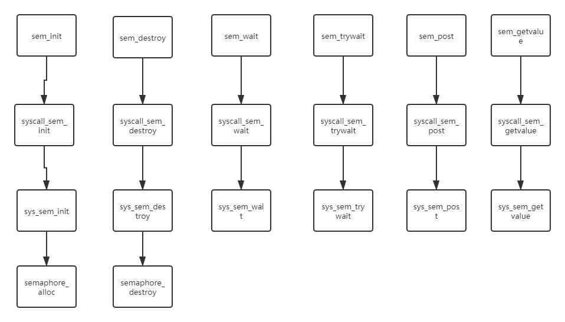
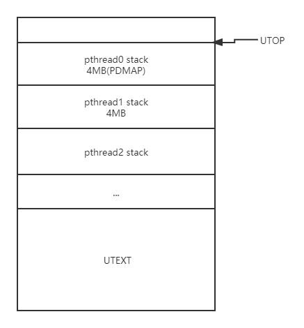
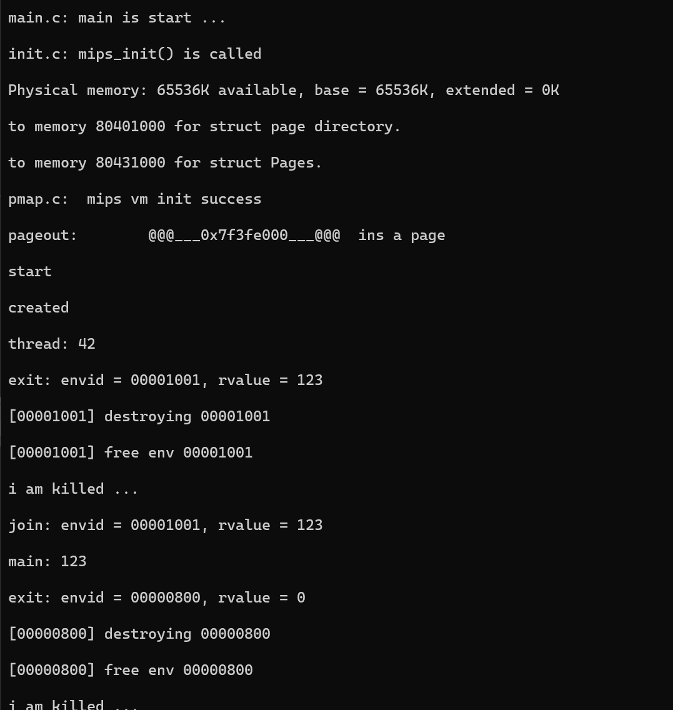

# Lab4 Challenge 实验报告

## 1. 实验内容介绍

lab4 挑战性任务需要按照POSIX标准，在MOS操作系统中实现线程(Thread)和信号量(Semaphore)机制。实验中，实现了所要求的无名信号量和线程的接口。  

### 1.1 POSIX Threads

在实验中的POSIX Threads共实现了以下几个函数，都位于头文件`<pthread.h>`中

#### 1.1.1 pthread_create

用于创建一个新的pthread线程。   
**pthread_create函数原型如下；**     
`int pthread_create(pthread_t* thread, const pthread_attr_t* attr, void *(*start_routine)(void*), void* arg);`    
**参数的意义为：**   

* `thread`；存储pthread线程的标识(id)，它用来唯一标识一个进程里的线程，由`pthread_create()`更改该值。
* `attr`：线程的属性。分别有`PTHREAD_CREATE_DETACHED`，即分离线程；`PTHREAD_CREATE_JOINABLE`，即可汇合线程。其中的可汇合线程为pthread线程的默认状态。在这种情况下，只有当`pthread_join()`函数返回时，创建的线程才算执行完毕。同样由`pthread_create()`进行修改。因为在实验中，没有实现有关线程分离(detached)的接口，因此在实际实现的时候，没有考虑属性。
* `start_routine`：函数指针。pthread线程创建以后执行的函数，可以带有参数arg
* `arg`：函数执行参数。即上文start_routine执行时的参数。  
  **函数返回值：**  
  如果线程创建成功，则返回0；否则返回错误代码，实验中为-1。可能会因为在一个进程下，因为达到可以拥有进程的最大数目，而导致线程创建上限。   

#### 1.1.2 pthread_exit

用于当前运行的pthread线程的退出。  
**pthread_exit函数原型如下：**   
`void pthread_exit(void *value_ptr);`   
**参数的意义为：**  

* `value_ptr`：`*value_ptr`表示线程的返回值，需要存储到线程相应的结构体中，而采用指针的方式只是为了保证字长一直，具有可移植性。该返回值会提供给`pthread_join()`使用。  

#### 1.1.3 pthread_cancel

用于一个指定线程的退出。需要注意与`pthread_exit()`的区别。（见1.1.2）  
**pthread_cancel函数原型如下：**  
`int pthread_cancel(pthread_t thread);`   
**参数的意义为：**   

* `thread`：需要终止的线程id   
  &nbsp;   
  用`pthread_cancel()`退出的线程具有一个常量返回值`PTHREAD_CANCELED`，其值为1。并将会提供给`pthread_join()`使用。
  如果线程成功取消，返回值为0，否则返回值为-1。可能会因为参数`thread`表示一个一个不存在的pthread线程而失败。   

#### 1.1.4 pthread_join

用于线程的汇合。阻塞调用线程调用，并等待线程结束。      
**pthread_join函数原型如下：**   
`int pthread_join(pthread_t thread, void **value_ptr);`  
**参数的意义为：**   

* `thread`：需要汇合的线程id
* `value_ptr`：需要汇合的pthread线程的返回值指针。    
  汇合成功返回值为0；否则返回值为-1;   
  因为并没有实现detached相关函数，因此创建的线程都要调用`pthread_join`   

### 1.2 POSIX Semaphore

实验中的POSIX Semaphore（无名信号量）共实现了以下函数，定义于头文件`<semaphore.h>`中   

#### 1.2.1 sem_init

创建一个信号量，并初始化它的值。一个无名信号量在使用前必须进行初始化。   
**sen_init函数原型如下：**    
`int sem_init(sem_t *sem, int pshared, unsigned value);`   
**参数的意义为：**  

* `sem`：信号量的标识(id)  
* `pshared`：信号量属性的标志。如果为0，表示该信号量在线程间进行共享。否则表示信号量在进程间进行共享。由于仅仅实现了无名信号量，而没有实现有名信号量，因此值默认为0。   
* `value`：信号量的初始值  

如果信号量创建成功则返回0，否则返回-1。可能会由于信号量的数目达到了操作系统定义的信号量数目最大值而导致创建失败。  

#### 1.2.2 sem_destroy

销毁一个用完的无名信号量。调用以后，不能再使用此信号量，除非在再次使用前对信号量重新进行初始化。  
**sem_destroy函数原型如下：**    
`int sem_destroy(sem_t *sem);`   
**参数的意义为：**   

* `sem`：需要销毁的信号量的标识

如果销毁成功返回值为0，否则返回值为-1  

#### 1.2.3 sem_wait

信号量P操作。将信号量的值减1。同时，在操作以前先检查信号量的值是否为0，如果**信号量为0，此函数会被阻塞**，直到信号量大于0的时候，才进行减1操作。    
**sem_wait函数原型如下：**    
`int sem_wait(sem_t *sem);`   
**参数的意义为：**   

* `sem`：需要执行P操作的信号量标识  

如果函数执行上述过程成功，返回值为0；否则返回值为-1。   

#### 1.2.4 sem_trywait

信号量P操作。将信号量的值减一。同时，在操作以前先检查信号量的值是否为0，如果值为0，则直接返回，而不执行P操作。   
**sem_trywait函数原型如下：**    
`int sem_trywait(sem_t *sem);`   
**参数的意义为：**    

* `sem`：需要执行P操作的信号量的标识。  

如果执行了P操作则函数返回值为0，否则函数返回值为-1（信号量值小于等于0）。  

#### 1.2.5 sem_post  

信号量V操作。将信号量的值加1，并发出信号唤醒等待的线程（因为`sem_wait()`而阻塞的线程）。   
**sem_post函数原型如下：**    
`int sem_post(sem_t *sem);`   
**参数的意义为：**    

* `sem`：需要执行V操作的信号量标识。  

如果成功执行了V操作则返回值为0，否则返回值为-1。  

#### 1.2.6 sem_getvalue

获取信号量的值
**sen_init函数原型如下：**    
`int sem_getvalue(sem_t* sem, int* sval);`   
**参数的意义为：**      

* `sem`：需要获取值的信号量的标识。
* `sval`：信号量值存储的位置。  

如果成功获取到了信号量的标识，则返回值为0，否则返回值为-1。

## 2. 实现思路

在实验中实现pthread线程机制是基于实验中所实现的无名信号量（用于线程间通信）。因此在实际实现的时候，首先实现了POSIX Semaphore。  

### 2.1 POSIX Semaphore实现

#### 2.1.1 POSIX Semaphore初始化

本次实验中的POSIX Semaphore是在操作系统的内核态实现的，并提供了相应的用户接口以供用户使用。实验中，给1.2所述的每个POSIX定义的用户接口分别实现了一个系统调用。   
在`include/semaphore.h`中定义了需要使用的宏，结构体和方便系统调用编写的函数，如下：   

```c
extern struct Sem* sems; //存储所有信号量的结构体
//操作系统定义的信号量最大数目
#define NSEM 1024 
//根据信号量结构体，计算信号量的数组索引，即信号量id
#define SEMX(sem_ref) ((sem_ref) - sems)


struct Sem {//信号量结构体
	LIST_ENTRY(Sem) sem_link;//用于将信号量结构体组织成链表
	u_int value; //信号量的值
	struct Env_list wait_list; //阻塞于该信号量的进程，用于sem_post时的进程唤醒
};

LIST_HEAD(Sem_list, Sem);

int semaphore_alloc(struct Sem** new);//分配一个信号量结构体
void semaphore_init(void);//初始化信号量，组织成链表以及成员变量初始化
void semaphore_destroy(int index);//回收信号量
```

在系统启动以后操作系统初始化`init/init.c/mips_init()`函数中的`mips_vm_init()`中分配了系统的`Sem`结构体，数目为`NSEM`。   
`sems = (struct Sem*)alloc(NSEM * sizeof(struct Sem), BY2PG, 1);`  
之后在`mips_init()`函数中调用`semaphore_init()`，类似于`env_init()`，将分配好的`Sem`结构体数组`sems`组织成链表，方便以后的分配。   
信号量初始化时的调用关系如下：   


此时，所有的`struct Sem`已经组织成为链表，**信号量的id为相应结构体在`sems`数组中的下标**。所以合法的id为`[0, NSEM - 1]`   
另外，因为一个进程控制块，要么在信号量挂起，要么在可执行队列，要么在空闲队列，因此在实现中，信号量下的等待队列复用了`struct Env`中的`env_link`。  
为了方便线程在挂起时退出，在struct Env中增加了成员变量`u_int env_wait`。值为1时表示进程挂起，当值为0的时候，表示进程处于可执行状态。在执行env_free函数的时候，由于此时进程可能阻塞在信号量中。因此当e->env_wait == 1的时候，首先需要将进程从信号量的阻塞队列中删除，然后才能插入到空闲列表中，如下代码所示。    

```c
void
env_free(struct Env *e, int free_vm) {
    ......

    e->env_status = ENV_FREE;
    if (e->env_wait) {
        LIST_REMOVE(e, env_link);
    }
    LIST_INSERT_HEAD(&env_free_list, e, env_link);
    LIST_REMOVE(e, env_sched_link);

```

#### 2.1.2 POSIX Semaphore接口实现

信号量的用户接口声明在了`user/lib.h`中，定义在了`user/usem.c`文件中，如下：   

```c
int sem_init(sem_t* sem, int pshared, u_int value) {
	return syscall_sem_init(sem, pshared, value);
}

int sem_destroy(sem_t* sem) {
	return syscall_sem_destroy(sem);
}

int sem_wait(sem_t* sem) {
	return syscall_sem_wait(sem);
}

int sem_trywait(sem_t* sem) {
	return syscall_sem_trywait(sem);
}

int sem_post(sem_t* sem) {
	return syscall_sem_post(sem);
}

int sem_getvalue(sem_t* sem, int* sval) {
	return syscall_sem_getvalue(sem, sval);
}
```

可以看出，每个信号量的用户操作都简单地对应了一个系统调用。  
与平时实验的系统调用实现一样，在`user/syscall_lib.c`中调用`msyscall`陷入内核态，执行相应的`sys_*`函数，同时在`include/unistd.h`中为每个系统调用声明一个系统调用号，以及在`lib/syscall.S`中声明系统调用字段。   
在`lib/syscall_all.c`中实现系统调用函数，以下说明每个函数的具体实现。   

1. `sys_sem_init`

```c
int sys_sem_init(int sysno, sem_t* sem, int pshared, u_int value) {
	if (pshared != 0) { //不支持有名信号量，因此如果pshared不为0，则直接返回错误
		printf("pshared not stand for anonymous semaphore\n");
		return -E_INVAL;
	}

	struct Sem* alloced_sem;
	int r;
	r = semaphore_alloc(&alloced_sem); //分配信号量
	if (r < 0) return r;//E_NOSPC
	alloced_sem->value = value;//设置信号量初始值
	LIST_INIT(&alloced_sem->wait_list);//初始化信号量中的阻塞队列
	*sem = SEMX(alloced_sem);//计算出信号量id，并通过指针返回
	return 0;
}
```

`sys_sem_init()`首先通过`semaphore_alloc`函数从空闲的Sem链表中取得第一个`Sem`结构体返回后，设置各个成员的初值，以及返回信号量标识。   

2. `sys_sem_destroy`

```c
int sys_sem_destroy(int sysno, sem_t* sem) {
	if (*sem >= NSEM) return -1;
	semaphore_destroy(*sem);
	return 0;
}
```

在`semaphore_destroy()`中，首先清空了信号量的等待队列，然后释放了`Sem`结构体。   

3. `sys_sem_wait`  

```c
int sys_sem_wait(int sysno, sem_t* sem) {
	struct Sem* semaphore = &sems[*sem];
	if (semaphore->value > 0) {
		semaphore->value--;
	}
	else {
		curenv->env_status = ENV_NOT_RUNNABLE;
		LIST_REMOVE(curenv, env_sched_link);
		LIST_INSERT_HEAD(&semaphore->wait_list, curenv, env_link);
		curenv->env_wait = 1;
		sys_yield();
	}
	return 0;
}
```

在`sys_sem_wait()`中主要难点在于如果信号量的值小于等于0，需要让当前线程阻塞，挂起在相应的信号量结构体中，在后来对信号量进行V操作以后，才可以唤醒。在该函数中需要将调用`sys_yield()`函数切换线程。    

1. `int sys_sem_trywait`  

```c
int sys_sem_trywait(int sysno, sem_t* sem) {
	struct Sem* semaphore = &sems[*sem];
	if (semaphore->value > 0) {
		semaphore->value--;
		return 0;
	}
	else return -1;
}
```

该函数与`sys_sem_wait()`函数的区别在于，当出现信号量小于等于0的时候，不会阻塞线程，而是直接返回错误码-1。    

5. `sys_sem_post`   

```c
int sys_sem_post(int sysno, sem_t* sem) {
	struct Sem* semaphore = &sems[*sem];
	semaphore->value++;
	if (semaphore->value > 0) {
		struct Env* e = LIST_FIRST(&semaphore->wait_list);
		if (e != NULL) {
			e->env_status = ENV_RUNNABLE;
			e->env_wait = 0;
			LIST_INSERT_HEAD(&env_sched_list[0], e, env_sched_link);
			LIST_REMOVE(e, env_link);
		}
	}
	return 0;
}
```

该函数将相应的信号量加1，如果在V操作以前信号量的值为0，则在V操作以后，检查阻塞队列中是否有线程处于挂起装态，如果有，将其状态设置为`ENV_RUNNABLE`，并加入到`env_sched_list`队列中。   

6. `sys_sem_getvalue`   

```c
int sys_sem_getvalue(int sysno, sem_t* sem, int* sval) {
	struct Sem* semaphore = &sems[*sem];
	
	int ans = 0;
	if (semaphore->value > 0) ans = semaphore->value;
	else {
		struct Env* e;
		LIST_FOREACH(e, &semaphore->wait_list, env_link) ans++;
	}
	*sval = -1 * ans;
	return 0;
}
```

在这个函数中如果信号量的值大于等于0，则直接返回信号量的值，否则，遍历阻塞队列，计算有多少个线程挂起，返回挂起线程数量的负值。因此对于函数`sem_getvalue()`而言，如果取得非负值，则为信号量的值；而如果为负值，则该值的绝对值为挂起线程的数量。  
&nbsp;
总的调用关系如下图所示：   
 
在信号量实现中，`sem_*`函数只是简单地调用了`syscall_sem_*`函数，主要是为了满足POSIX标准中定义的函数接口。   

### 2.1 POSIX thread实现

`pthread`的实现是在`semaphore`的基础上进行的，同时难度也增大了很多。   

#### 2.1 使用的数据结构及初始化

pthread所使用的数据结构定义于`include/pthread.h`中，如下：    

```c
#define NTHREAD 64 //每个进程所支持线程的最大值

#define NSPAC -1 //错误码，创建线程因为达到最大数目而发生错误
#define PTHREAD_CANCELED -1 //pthread_cancel所要求的线程返回值常量

#define USING 1 //标记线程在使用
#define UNUSE 0 //标记线程不在使用

typedef u_int pthread_t; //标准中要求定义的pthread标识

void pthread_init(void); 

int pthread_create(pthread_t* thread,
    const pthread_attr_t* attr,
    void* (*start_routine)(void*), void* arg);
void pthread_exit(void* value_ptr);
int pthread_cancel(pthread_t thread);
int pthread_join(pthread_t thread, void** value_ptr);


typedef struct thread { //线程结构体，属于进程
    LIST_ENTRY(thread) thread_link;//将线程控制块组织成链表
    u_int env_id; //线程对应的env_id
    sem_t semaphore; //线程信号量
    int rvalue; //线程返回值
    int status; //线程状态UNUSE/USING
} Thread;
LIST_HEAD(Thread_list, thread);

extern struct Thread_list Thread_free_list; //空闲线程链表
extern Thread threads[NTHREAD];
```

在进程初始化时，调用了pthread_init函数，来讲线程结构体组织成链表，同时将0号线程分配给创建进程后的主线程。   

#### 2.2 pthread接口实现

实验中，pthread是在用户态以及系统调用实现的，在`user/pthread.c`中实现了这些接口。   

1. `pthread_create`   

```c
int pthread_create(pthread_t* thread, const pthread_attr_t* attr,
	void* (*start_routine)(void*), void* arg) {
	int r;
	//writef("1\n");
	Thread* t = LIST_FIRST(&Thread_free_list);
	if (t == NULL) return NSPAC;
	t->status = USING;
	sem_init(&t->semaphore, 0, 0);
	t->rvalue = 0;
	LIST_REMOVE(t, thread_link);
	int id = (t - threads);
	*thread = id;

	//writef("1\n");
	u_int uxstacktop = UTOP - id * PDMAP;
	//writef("%08x\n", uxstacktop);
	if (syscall_mem_alloc(0, uxstacktop - BY2PG, PTE_V | PTE_R) < 0)
		user_panic("alloc thread exc stack failed.");
	if (syscall_mem_alloc(0, uxstacktop - 3 * BY2PG, PTE_V | PTE_R) < 0)
		user_panic("alloc thread stack failed.");
	if ((r = syscall_pthread_alloc(&thread_main, start_routine, arg, uxstacktop - 2 * BY2PG, &(t->env_id))) < 0) return r;

	//writef("1\n");
	r = syscall_set_pgfault_handler(t->env_id, __asm_pgfault_handler,uxstacktop);
	//writef("sysall_set_pgfault_handler finished\n");
	if (r < 0) user_panic("syscall_set_pgfault_handler failed");
	r = syscall_set_env_status(t->env_id, ENV_RUNNABLE);
	//writef("syscall_set_env_status finished\n");
	if (r < 0) user_panic("syscall_set_env_status failed");
	remaining_threads++;
	//writef("1\n");
	return 0;
}
```

`pthread_create`函数应该是实验中，最难的一个部分。它的流程是，首先分配一个线程结构体，初始化它的状态，初始化线程信号量等工作。   
其后是分配线程栈空间，首先说明一下在实现中的进程空间分布的问题，如下图所示：   
  
自UTOP向下依次分配线程栈，每个线程栈顶分别由4KB的`user exception stack`和`Invalid memory`空间。同时自顶向下线程id号依次增加，因此可以通过栈指针得到线程的id号。   
$(UTOP - temp\_var\_addr) / PDMAP = pthread\_id$   
反过来，也可以通过线程的id号得到它的栈的位置:   
$pthread\_uxstacktop = UTOP - id * PDMAP$   
在`pthread_create`函数中就采用这种方法计算的线程栈的位置。分配好异常栈和线程栈。然后通过系统调用`syscall_pthread_alloc`分配一个Env结构体，该系统调用在后面进行解释。接着设置异常处理函数，最后设置好线程状态为`ENV_RUNNABLE`，然后就可以参与进程（线程调度)      

线程需要执行一个`start_routine`函数。假定直接执行此函数，函数执行完毕以后，需要进行返回，而此时线程已经位于线程栈顶，如果返回，将会出现错误。因此在设计的时候借鉴了mos操作系统的进程执行。pthread线程将不会直接执行需要的函数，而是定义一个`thread_main`函数（实际执行的函数），在`start_routine`函数执行完毕以后，调用pthread_exit函数从而正常返回，具体的实现如下：   

```c
void thread_main(void* arg0, void* arg1) {
	void* (*start_func)(void*) = (void* (*)(void*))arg0;
	pthread_exit(start_func(arg1));
}
```

其中arg0为线程需要执行的函数。   

系统调用`syscall_pthread_alloc`衍生自`syscall_env_alloc`，主要区别在于`syscall_pthread_alloc`不执行`env_setup_vm`。同时它会将`thread_main`函数的地址设置为第一个参数(`a0`)，将`start_routine`需要的参数`arg`设置为第二个参数(`a1`)。栈地址设置为线程真实的栈地址而不是`UTOP`，设置新的线程`pgdir`和`pri`继承自创建它的线程。   

2. `pthread_exit`   

```c
void pthread_exit(void* value_ptr) {
	int tmp;
	u_int stack = (u_int)&tmp;
	int id = (UTOP - stack) / PDMAP;
	Thread* t = &threads[id]; //get cur Thread struct
	t->rvalue = value_ptr;
	writef("exit: envid = %08x, rvalue = %u\n", t->env_id, t->rvalue);
	sem_post(&t->semaphore);

	if (remaining_threads == 1) syscall_env_destroy(t->env_id, 1); // last thread
	else syscall_env_destroy(t->env_id, 0);
	t->status = UNUSE;
	remaining_threads--;
	return;
}
```

该函数退出当前线程。首先在于需要获取线程相应的结构体，上文已经叙述了，通过栈地址获取线程id的方法，即：   
$(UTOP - temp\_var\_addr) / PDMAP = pthread\_id$      
因此在函数中首先声明了一个临时变量，式子：`int id = (UTOP - stack) / PDMAP;`。根据公式计算了线程id。  
之后V操作线程信号量，通知可以唤醒需要join的线程。   
需要注意的一点是，需要判断当前退出进程是否是进程的最后一个线程，如果是最后一个线程需要将进程持有的资源一并释放。  
在此处更改了`syscall_env_destroy`函数，**如果是退出线程，不执行env_free中的有关线程环境的部分。如果是最后一个线程（进程）退出，需要释放进程资源**     


3. `pthread_cancel`

```c
int pthread_cancel(pthread_t thread) {
	if (thread >= NTHREAD) {
		return -1;
	}
	Thread* t = &threads[thread];
	t->rvalue = PTHREAD_CANCELED;
	syscall_env_destroy(t->env_id, 0);
	t->status = USING;
	remaining_threads--;
	return 0;
}
```

取消一个线程，设置线程返回值为PTHREAD_CANCELED，同时处理掉线程的Env。与pthread_exit基本类似。   

4. `pthread_join`  

```c
int pthread_join(pthread_t thread, void** value_ptr) {
	if (thread >= NTHREAD) {
		return -1;
	}
	Thread* t = &threads[thread];
	sem_wait(&t->semaphore);
	writef("join: envid = %08x, rvalue = %u\n", t->env_id, t->rvalue);
	*value_ptr = t->rvalue;
	pthread_destroy(t);
	return 0;
}
```

线程汇合，调用POSIX Semaphore实现的sem_wait函数，等待需要汇合的线程执行完毕。保存线程返回值，然后回收掉线程控制块。   
**注意不能在pthread_exit或pthread_cancel中回收线程控制块，因为此时的线程返回值是要提供给pthread_join的，而返回值存在于线程控制块中，因此只有在取得返回值以后才可以回收线程控制块**   

### 2.3 其他需要的考虑

#### 2.3.1 fork相关

由于pthread的引入，需要考虑由一个线程创建一个进程的情形，根据使用中的线程布局，新线程不应该设置每个线程的user exception stack和Invalid memory，在duppage调用前应该进行判断。如下代码所示：   

```c
//fork.c fork()
for (i = 0; i < UTOP; i += BY2PG)
	{
		if ((UTOP - i) / PDMAP < NTHREAD && ((i + BY2PG) % PDMAP == 0 || (i + 2 * BY2PG) % PDMAP == 0)) {
			continue;
		}
		if ((((Pde *)(*vpd))[i >> PDSHIFT] & PTE_V) && (((Pte *)(*vpt))[i >> PGSHIFT] & PTE_V))
		{
			//writef("%x\n",(*vpt)[VPN(i)]);
			duppage(newenvid, VPN(i));
		}
	}
```

#### 2.3.2 pgfault相关

处理每个线程的pgfault的时候，需要注意不能覆盖其他线程的栈，因此应该在每个线程栈内部进行处理。分配临时空间的时候，应该首先计算需要分配页面在进程空间中的位置。   

```c
static void
pgfault(u_int va)
{
	u_int tmp;
	va = ROUNDDOWN(va, BY2PG);
	u_int perm = (*vpt)[VPN(va)] & 0xfff;
	//	writef("fork.c:pgfault():\t va:%x\n",va);
	if(!(perm & PTE_COW))  user_panic("pgfault: not COW");
    //map the new page at a temporary place
	tmp = ROUND(&tmp) - 2 * BY2PG;
	if(syscall_mem_alloc(0,tmp,PTE_V|PTE_R)<0) 
		user_panic("pgfault: syscall_mem_alloc error");
	//copy the content
	user_bcopy(va,tmp,BY2PG);
	
    //map the page on the appropriate place
	if(syscall_mem_map(0,tmp,0,va,PTE_V|PTE_R)<0) 
		user_panic("pgfault: syscall_mem_map error");
    //unmap the temporary place
	if(syscall_mem_unmap(0,tmp)<0)
		user_panic("pgfault: syscall_mem_unmap error");
}
```

代码中的`tmp = ROUND(&tmp) - 2 * BY2PG;`，计算了需要分配的临时空间的位置（每个线程栈中的Invalid memory位置）   

#### 2.3.3 进程退出相关

注意在user/libos.c中的exit()函数，是线程退出函数，需要注意此时是否有其他线程还在执行，首先需要遍历threads线程控制块数组，将所有的除主线程之外的线程调用pthread_exit(NULL)退出。最后通过系统调用syscall_env_destroy(0, 1)退出主线程。实现进程最后的退出。   

```c
//libos.c   
#include "lib.h"
#include <mmu.h>
#include <env.h>
#include <pthread.h>

extern Thread threads[NTHREAD];

void
exit(void)
{
	//close_all();
	int i = 1;
	for (i; i < NTHREAD; ++i) { // check if there are other threads remain
		if ((threads + i)->status == USING) {
			pthread_exit(NULL);
		}
	}
	syscall_env_destroy(0, 1);
}


struct Env *env;

void
libmain(int argc, char **argv)
{
	// set env to point at our env structure in envs[].
	env = 0;	// Your code here.
	//writef("xxxxxxxxx %x  %x  xxxxxxxxx\n",argc,(int)argv);
	int envid;
	envid = syscall_getenvid();
	envid = ENVX(envid);
	env = &envs[envid];
	pthread_init();
	// call user main routine
	umain(argc, argv);
	// exit gracefully
	exit();
	//syscall_env_destroy(0);
}
```


## 3. 实验测试

由于时间关系，暂时只对基本功能进行了测试，在接下来的几天时间里，会尽量达到较高的测试覆盖率。测试代码如下：   

```c
#include "lib.h"
#include "pthread.h"

void *fn(void *arg) {
	writef("thread: %d\n", (int)arg);
	return 123;
}


void umain()
{
	writef("start\n");
	pthread_t t;
	pthread_create(&t, NULL, &fn, 42);
	writef("created\n");
	void *ret;
	pthread_join(t, &ret);
	writef("main: %d\n", (int)ret);
}
```

## 5. 实验结果

初步测试的结果如下所示：   
  
随后会对全部接口进行充分测试，考虑实现一个多线程排序来进行功能展示。   
综上，pthread是在信号量的基础上进行的，由于pthread的引入，原本的单线程进程有的地方需要针对多线程进行修改，这时挑战性任务最大的难点，主要就是要充分考虑。   
